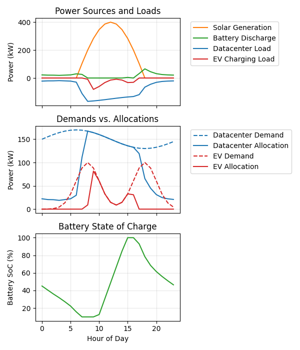

# Stochastic Model Predictive Control (SMPC) for Renewable Energy Microgrid



## Table of Contents
- [Overview](#overview)
- [SMPC Explained](#smpc-explained)
- [Model Implementation](#model-implementation)
- [Mathematical Formulation](#mathematical-formulation)
- [Convexity](#convexity)
- [Environment Setup](#environment-setup)
- [Usage](#usage)
- [Output](#output)

## Overview

This repository implements a Stochastic Model Predictive Control (SMPC) framework for optimizing power allocation in a toy renewable energy microgrid. The system manages power flow between solar generation, battery storage, datacenter loads, EV charging, and grid import/export to minimize operational costs while handling forecast uncertainty.

## SMPC Explained

Stochastic Model Predictive Control (SMPC) is a control methodology for optimizing decision making under uncertainty. In this example, the decision to be made is the resource allocation at each time step. The uncertainty arises from randomness due to weather and power demand. In SMPC, we sample possible futures, evaluate a cost function over those futures, and base our allocation on the statistics of the simulation.

## Model Implementation

Our implementation models a microgrid with:
- Solar PV generation (with forecast uncertainty)
- Battery energy storage
- Datacenter load (high priority)
- EV charging load (flexible)

The controller makes decisions on:
- Power allocation to each load
- Battery charging/discharging
- Load curtailment when necessary

## Mathematical Formulation

The SMPC formulation consists of:

1. **Decision Variables**:
   - Power allocation to loads
   - Battery charge/discharge rates
   - Grid import/export
   - Unmet load variables
   
2. **Constraints**:
   - Power balance at each time step
   - Battery dynamics and capacity limits
   - Load requirements

3. **Objective Function**:
   - Minimize penalties for unmet loads

## Convexity

The SMPC implementation is a linear program (LP), making it convex and efficiently solvable:

1. All decision variables are continuous
2. All constraints are affine (linear equalities or inequalities)
3. The objective function is a weighted sum of linear terms
4. No binary variables or bilinear constraints are included in the model

Being an LP, our model guarantees:
- Global optimality (if a solution exists)
- Efficient solution using standard solvers
- Scalability to large problem instances

I use `cvxpy` as a convex solver.

## Environment Setup

This project uses `uv` for package management:

```bash
# Install uv if you don't have it
curl -sSf https://astral.sh/uv/install.sh | bash

# Create virtual environment and install dependencies
uv venv
uv pip install cvxpy numpy pandas matplotlib

# Activate the environment (Linux/Mac)
source .venv/bin/activate

# Or on Windows
# .venv\Scripts\activate
```

## Usage

Run the simulation:

```python
from smpc import run_simulation

# Run the simulation and display results
results_df = run_simulation()
```

## Output


This image shows the simulation results of the SMPC controller over a 24-hour period. The top panel displays power sources (solar generation and battery discharge) and loads (datacenter and EV charging). The middle panel compares the actual demands versus power allocations for both the datacenter and EV charging. The bottom panel shows the battery state of charge throughout the day.
